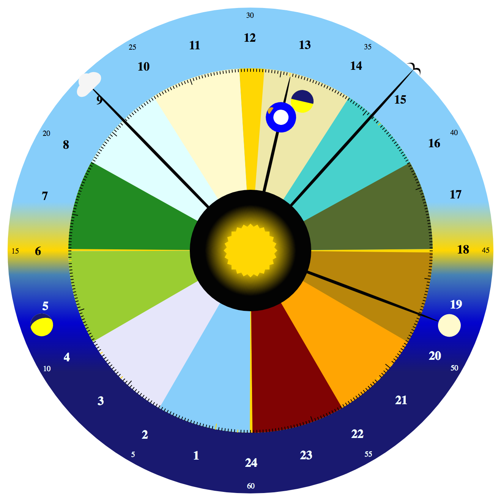

Season Clock
=================

If the year was divided into a 24-hour clock, centered around the [solstices](http://en.wikipedia.org/wiki/Solstice) and [equinoxes](http://en.wikipedia.org/wiki/Equinox), then what time of the year would it be now?

To answer this question, I created this 'Season Clock' with just some HTML, CSS, and javascript. Inspired by the way the [Shire Reckoning Calendar](http://psarando.github.io/shire-reckoning) divides the year, this clock starts each year on Dec. 21st, at midnight at the bottom of the clock, and marks June 21st at noon (in non-leap years) at the top of the clock.

The outer edge of the clock shows the hour of the day, and the center of the clock shows the current minute and seconds.

The middle part of the clock is divided into colored sections, each spanning the average length of a Moon cycle (about 29.5 days); in other words, each colored section is about 1-moonth of the year. The remaining days of the year are centered symmetrically near the dates of the [solstices](http://en.wikipedia.org/wiki/Solstice) and [equinoxes](http://en.wikipedia.org/wiki/Equinox). Notice that there are more days in the half of the year around the June solstice than there are around the December solstice, so the gold-colored, extra-days section is larger around the June solstice.

Each day of the year is marked with a small tick around the edge of the middle, seasonal part of the clock. The first of each month of the Gregorian calendar is marked with a larger tick.

To make the clock a little more interesting, the 'year hand' that marks the current day of the year also has a representation of the Earth and moon on it. The moon will change phase to show the approximate phase of the actual Moon, and the Earth will move up and down the 'year hand' toward the central sun or toward the moon in approximate relation to the Earth's distance from the Sun.

## This is not a scientific instrument

The actual [solstices](http://en.wikipedia.org/wiki/Solstice) and [equinoxes](http://en.wikipedia.org/wiki/Equinox) vary dates and times from year to year. To keep things simple, and to imitate a mechanical novelty clock, this clock will always show Dec. 21st at the bottom of the clock, March 20th at 6AM on the left of the clock, Sept. 22nd at 6PM at the right of the clock, and June 21st at noon (in non-leap years) at the top of the clock. Also keep in mind that the moon phases and Earth's relative distance from the sun are just approximations, and are not to scale.

## Example Screenshots

January 4th, 2014, near Earth's perihelion (nearest to the Sun).

February 14th, 2014, near a full Moon.

April 20th, 2014, with a waning gibbous Moon near its 3rd quarter.

July 4th, 2014, near Earth's aphelion (furthest from the Sun).

October 31st, 2014, near the Moon's 1st quarter.

December 21st, the starting point of this clock, each year. Shown here in 2014 near a New Moon.

## License

Copyright (C) 2014 Paul Sarando

Distributed under the [Eclipse Public License](http://www.eclipse.org/legal/epl-v10.html).
