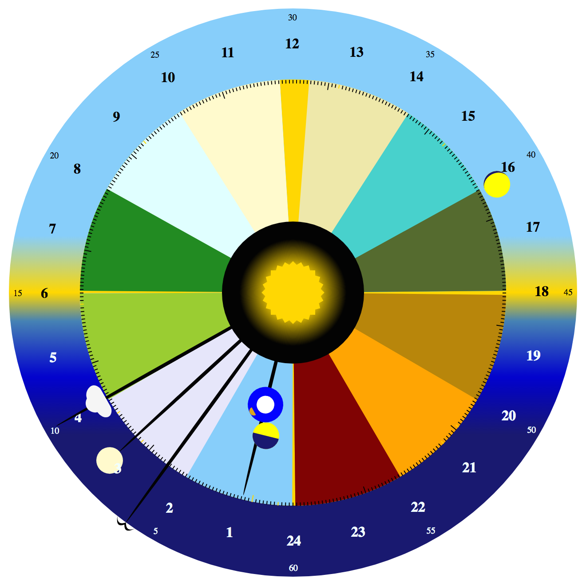
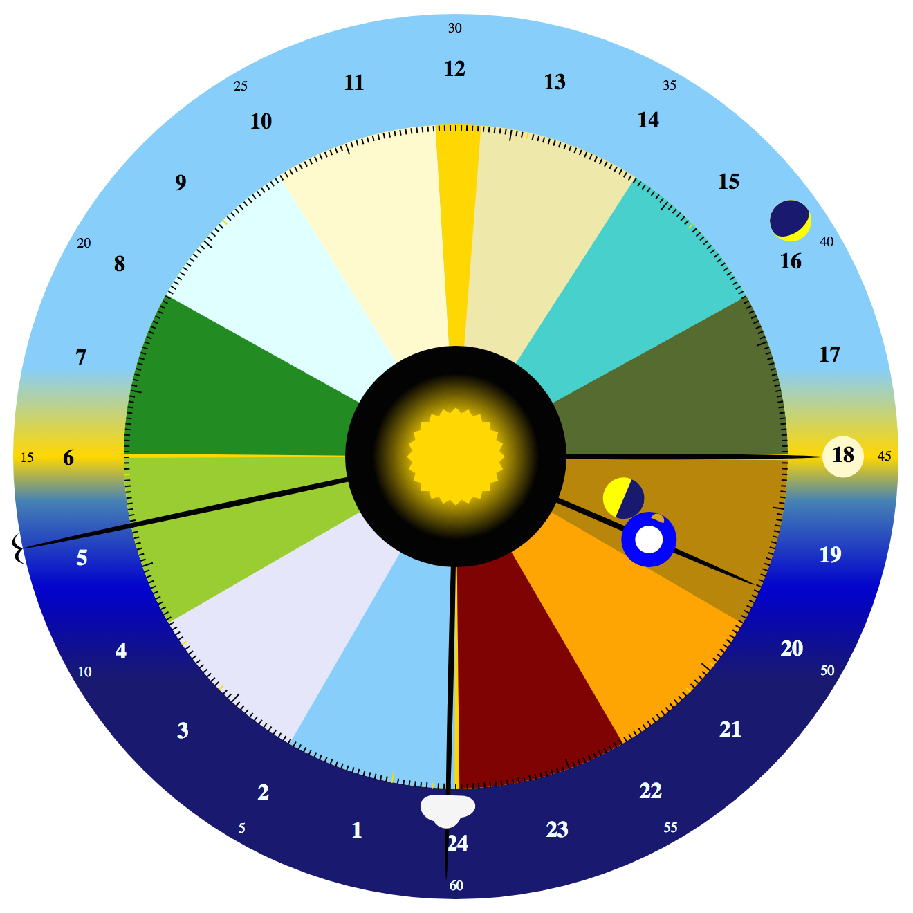
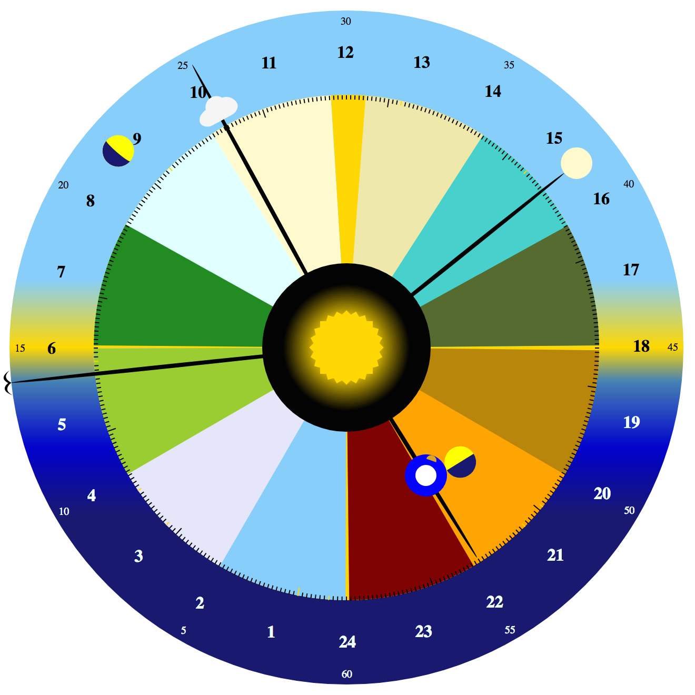

Season Clock
============

If the year was divided into a 24-hour clock,
centered around the [solstices](http://en.wikipedia.org/wiki/Solstice) and [equinoxes](http://en.wikipedia.org/wiki/Equinox),
then what time of the year would it be now?

To answer this question, I created this 'Season Clock' with just some HTML, CSS, and javascript.
Inspired by the way the [Shire Reckoning Calendar](http://psarando.github.io/shire-reckoning) divides the year,
this clock starts each year on Dec. 21st, at midnight at the bottom of the clock,
and marks June 21st at noon (in non-leap years) at the top of the clock.

The outer edge of the clock shows the hour of the day,
and the center of the clock shows the current minute and seconds.

The middle part of the clock is divided into colored sections,
each spanning the average length of a Moon cycle (about 29.5 days);
in other words, each colored section is about 1-moonth of the year.
The remaining days of the year are centered symmetrically near the dates of the
[solstices](http://en.wikipedia.org/wiki/Solstice) and [equinoxes](http://en.wikipedia.org/wiki/Equinox).
Notice that there are more days in the half of the year around the June solstice than there are around the December solstice,
so the gold-colored, extra-days section is larger around the June solstice.

Each day of the year is marked with a small tick around the edge of the middle, seasonal part of the clock.
The first of each month of the Gregorian calendar is marked with a larger tick.

To make the clock a little more interesting, the 'year hand' that marks the current day of the year
also has a representation of the Earth with its moon in orbit,
and the Earth will move up and down the 'year hand' toward the central sun
or toward the outer edge of the clock in approximate relation to the Earth's distance from the Sun.

The outer edge of the clock also has a moon icon that will change its phase
to show the approximate phase of the actual Moon,
and it rotates around the edge in a way that approximates the actual Moon's distance from the Sun in the sky.

## This is not a scientific instrument

The actual [solstices](http://en.wikipedia.org/wiki/Solstice) and [equinoxes](http://en.wikipedia.org/wiki/Equinox)
vary dates and times from year to year.
To keep things simple, and to imitate a mechanical novelty clock,
this clock will always show December 21st at the bottom of the clock,
March 20th (in non-leap years) at 6AM on the left of the clock,
June 21st (in non-leap years) at noon at the top of the clock,
and September 22nd at 6PM at the right of the clock.
Also keep in mind that the moon phases
and the Earth, Moon, and Sun relative distances are just approximations,
and are not to scale.

## Example Screenshots

December 21st at noon, the starting point of this clock, each year.
Shown here in 2014 near a new moon.

January 4th, 2015 at 03:10:06, near Earth's perihelion (nearest to the Sun)
and about 1 day before a full moon.

April 15th, 2015 at 09:50:14, with a waning crescent moon.

June 20th, 2015 at 19:21:07, with a waxing crescent moon, before its 1st quarter.

July 4th, 2015 at 19:20:36, near Earth's aphelion (furthest from the Sun)
and with a waning gibbous moon.

September 13th, 2015 at 06:41:23, during a solar eclipse.

October 15th, 2015 at 18:00:13, with a waxing crescent moon.

November 19th, 2015 at 15:25:14, with a waxing gibbous moon, near its 1st quarter.

## License

Copyright (C) 2016 Paul Sarando

Distributed under the [Eclipse Public License](http://www.eclipse.org/legal/epl-v10.html).
